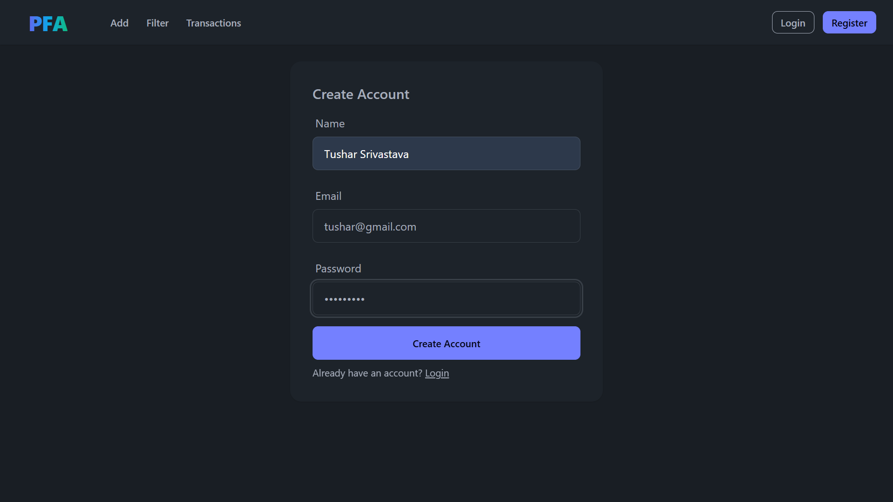
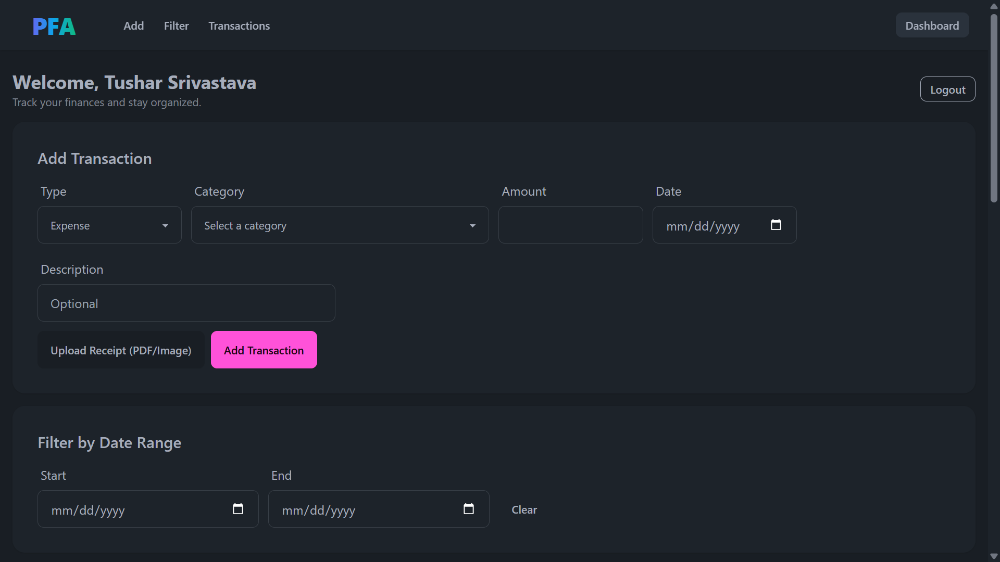
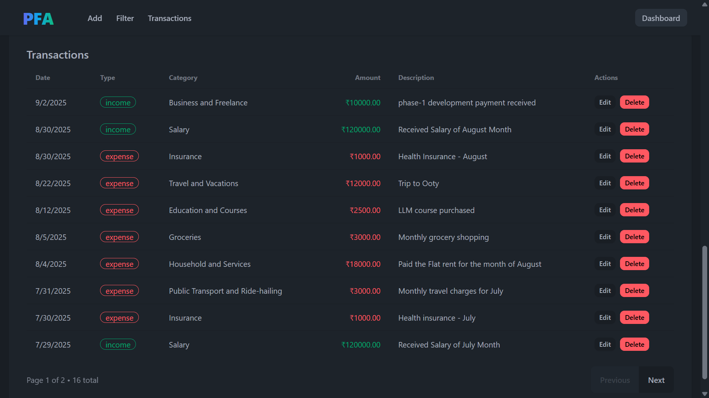
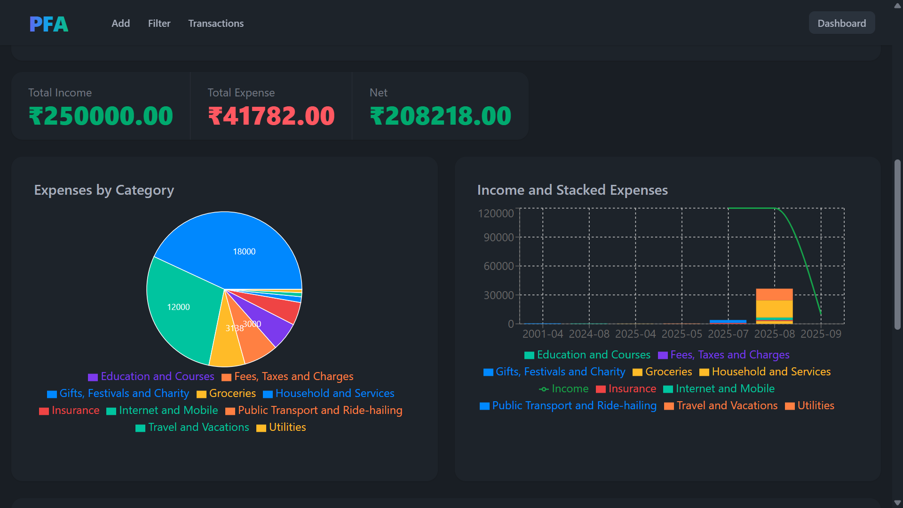

# Personal Financial Agent

Personal Financial Agent is a lightweight MERN application to track income and expenses, categorize them, and visualize your spending trends. It includes a clean dashboard with summaries, category-wise breakdowns, and a time-series chart. Users can add transactions manually or upload a receipt to auto-extract items using Azure Document Intelligence.

---

## Table of Contents
- [Core Idea](#core-idea)
- [Tech Stack](#tech-stack)
- [Live Demo](#live-demo)
- [Features Implemented](#features-implemented)
- [Screenshots](#screenshots)
- [Installation and Usage](#installation-and-usage)
- [Future Updates](#future-updates)
- [About Me](#about-me)

## Core Idea
- Add income/expense fast — either manually or via receipt upload with AI extraction.
- Track income and expenses with clean categorization sorted by date.
- Get instant insights: totals, category-wise breakdowns, and income vs expense, remaining balance.
- Keep the experience simple, responsive, and focused on essentials.

## Tech Stack

- Frontend:
  - React 19 + Vite 7
  - Redux Toolkit + React Router
  - Tailwind CSS + DaisyUI
  - Recharts (visualizations)
  - Axios

- Backend:
  - Node.js + Express 5
  - MongoDB + Mongoose
  - JWT (httpOnly cookie sessions)
  - Multer (receipt upload)
  - Azure AI Document Intelligence (receipt parsing)
  - CORS, dotenv, validator

## Live Demo
- Yet to be deployed

## Features Implemented
- Authentication:
  - Register, login, logout via secure httpOnly cookies
  - Me endpoint to restore session on refresh
- Transactions:
  - Create, list (paginated), edit, delete
  - Bulk add from parsed receipt items
  - Server-side validation + category allowlist
- Reporting:
  - Summary totals (income, expense, net amount remaining)
  - Expenses by category (pie chart)
  - Timeline with income line + stacked expense categories
  - Date range filters across dashboard and list
- Receipt AI:
  - Upload image/PDF
  - Auto-extract merchant/date/items via Azure Document Intelligence
  - Smart category suggestions on client; multi-select and bulk add
- UX:
  - Responsive UI with Tailwind + DaisyUI
  - Smooth navigation to sections
  - Helpful error states and loading indicators

## Screenshots
- User Registration: 
- Dashboard Overview: 
- Transactions List: 
- Expense Visualization: 

## Installation and Usage

Prerequisites:
- Node.js 18+ and npm
- MongoDB connection string (Atlas or local)
- Optional (for receipt AI): Azure Document Intelligence endpoint + key

1) Clone
- `git clone <repo-url>`
- `cd PersonalFinanceAssistant`

2) Backend setup
- `cd backend`
- Copy env: `cp .env.example .env`
  - Set `MONGO_URI`, `JWT_SECRET`, and `FRONTEND_URL` (e.g., `http://localhost:5173`)
  - Optional for receipt OCR:
    - `AZURE_DI_ENDPOINT=https://<your-resource>.cognitiveservices.azure.com/`
    - `AZURE_DI_KEY=<your-key>`
    - `AZURE_DI_MODEL=prebuilt-receipt`
- Install deps: `npm install`
- Run dev server: `npm run dev`
  - Default from example: `PORT=5000`

3) Frontend setup
- `cd ../frontend`
- Create `.env` with API base (match your backend port):
  - `VITE_API_URL=http://localhost:5000`
- Install deps: `npm install`
- Start dev: `npm run dev` (Vite defaults to `http://localhost:5173`)

4) Use the app
- Open `http://localhost:5173`
- Register → Login
- Add transactions manually OR click “Analyze Receipt” to upload a bill and bulk-add items
- Filter by date range; view dashboard charts and transaction list
- Edit/Delete entries as needed

Notes:
- CORS: Backend uses `FRONTEND_URL`; ensure it matches your Vite URL (default `http://localhost:5173`).
- Sessions: Auth uses httpOnly cookies; requests should include credentials (the frontend is configured).

## Future Updates
- Budgets and alerts per category
- Recurring transactions and reminders
- CSV/Excel import-export; bank statement parsing
- Editable category taxonomy and custom categories
- Multi-currency and localization
- Tests (unit/integration)

## About Me
- Name: Tushar Srivastava
- GitHub: https://github.com/official-Tushar
- LinkedIn: https://www.linkedin.com/in/tusharsrivastava8404/
- Email: tusharsrivastava8404@gmail.com
